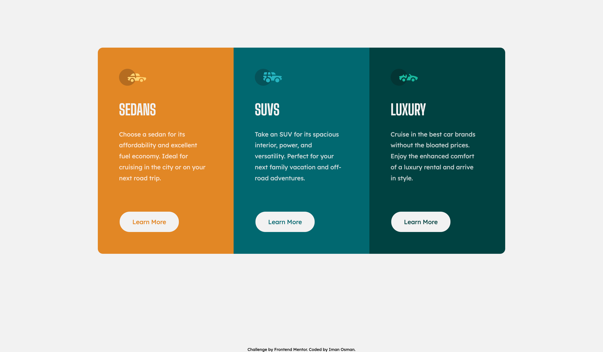
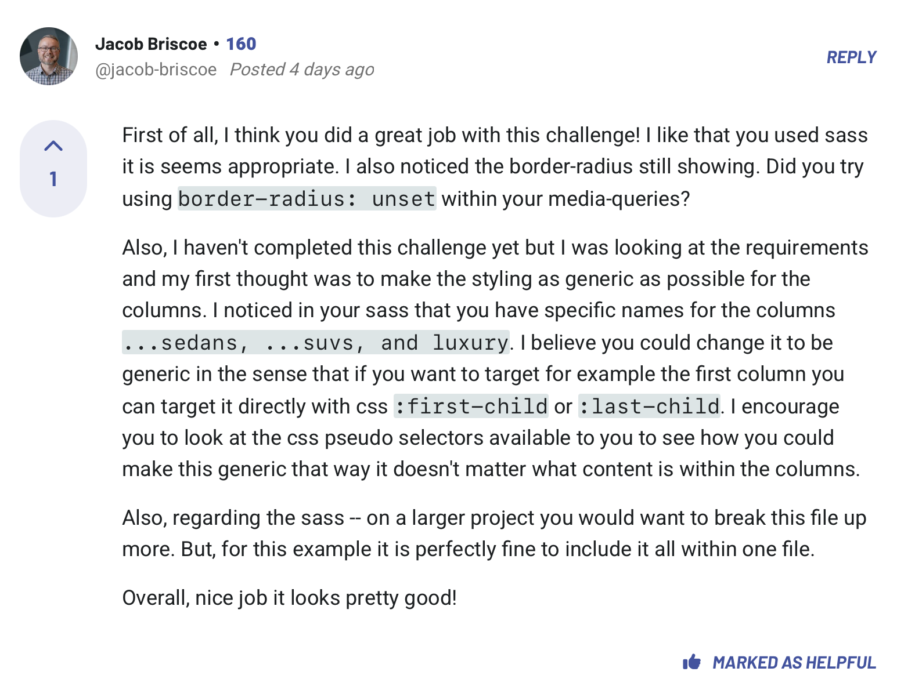

# Frontend Mentor - 3-column preview card component solution

This is a solution to the [3-column preview card component challenge on Frontend Mentor](https://www.frontendmentor.io/challenges/3column-preview-card-component-pH92eAR2-).

## Table of contents

- [Overview](#overview)
- [Goal](#goal)
- [Outcome](#outcome)
- [My process](#my-process)
- [Built with](#built-with)
- [Feedback](#feedback)
- [Lessons](#lessons)
- [Take forward](#take-forward)

## Overview

This is a 3-column layout using Flex. I'm going to revert back to using a Desktop-first workflow after having experimented with Mobile-first for a number of weeks. I find it's my preference. With mobile-first, I tended to underestimate the work required in the media queries. I prefer to tackle the bigger task first.

## Goal

My goal here is to reprioritise my Sass. After getting in some early practice after the Winter break, I want to refocus on making the best use of Sass since I really enjoy it. This layout seems simple enough where I can both resolve it with my code and explore some ways that Sass syntax can assist me in writing DRY code, too.

## Outcome

:jigsaw: [Live Site URL](https://i000o.github.io/3-column-preview/)  
:pencil2: [Solution URL](https://www.frontendmentor.io/solutions/responsive-3-column-layout-with-active-states-using-sass-KqAdmNxmgL)

## Built with

:gear: Semantic HTML5 markup  
:gear: CSS Flex  
:gear: Desktop-first workflow  
:gear: Sass

## My process

:alien: As always, I mapped out my HTML elements first, planning a little bit. I enjoy this step and try not to rush it since it can keep everything so clean once you get into the problem-solving.  
:alien: I setup my files and repos nice and organised, I began styling the basics of this layout with Sass.  
:alien: I implemented mixins, variables, nesting and partials this time. I love using these. I love seeing a concise Sass file for what I know would be longer CSS.  
:alien: Something I noticed in one of my earlier designs was the fact that I hadn't landmarked my HTML properly. I'd neglected to use the `<main>` tag anywhere. I understand why I did this because I was making basic, static pages where there was no 'main' content to differentiate from any other. However, I don't want to get into the habit of this. So, I made sure to include it here and target it in CSS separate from `<body>`.  
:alien: I made really good use of `flex-shrink: 0;` at one point. Beforehand, I would've spent a long time trying to figure out how to stop items from shrinking, using `max-width` or other means, but this is the simplest, fastest and most effective way and it feels so good to sort it in one line and then move onto more interesting problems. :joy:

## Time taken

:alarm_clock: Mobile: 1 hr  
:alarm_clock: Desktop: 2 hrs

## Feedback

:pencil2: I received incredible feedback from a peer-learner on Frontend Mentor about my code in this project. While crediting the work I'd done, they'd also helped me uncover something I wasn't aware of that has served me very well since. I had neglected to make the most out of pseudoclasses. Instead, I tended to label some elements with classes to target them in CSS. But this piece of feedback reminded me of `:first-child`, `:nth-child()`... This is of course, so much easier and makes far better use of my CSS than before, so I'm happy to know this now.

:star: <q>_I think you did a great job with this challenge! I like that you used sass it_<q>  
:star: <q>_Overall, nice job it looks pretty good!_<q>

## Lessons

1. The difference between `hover` and `active` states - I saw other devs make this error and gave feedback to help them.
2. I made really good use of `flex-shrink: 0`. It's still a somewhat elusive concept to me, but using it helps to demysitfy.
3. Don't forget to landmark properly! Using `<main>` for instance. This will become more important the more content you begin to work with...
4. I did a good job with my Sass on this challenge :slightly_smiling_face:
5. Pseudo-classes `:first-child` and `:nth-child()`! So useful and much better than using classes alone.
6. I styled this page really fast. My confidence has grown a lot since I started using CSS.

## Take forward

:grey_exclamation: Pseudo-classes `:first-child` and `:nth-child()`  
:grey_exclamation: Using the `<main>` tag to landmark  
:grey_exclamation: Use `flex-shrink` more!  
:grey_exclamation: Keep using Sass and all it has to offer - It makes life so much easier :sparkling_heart:
